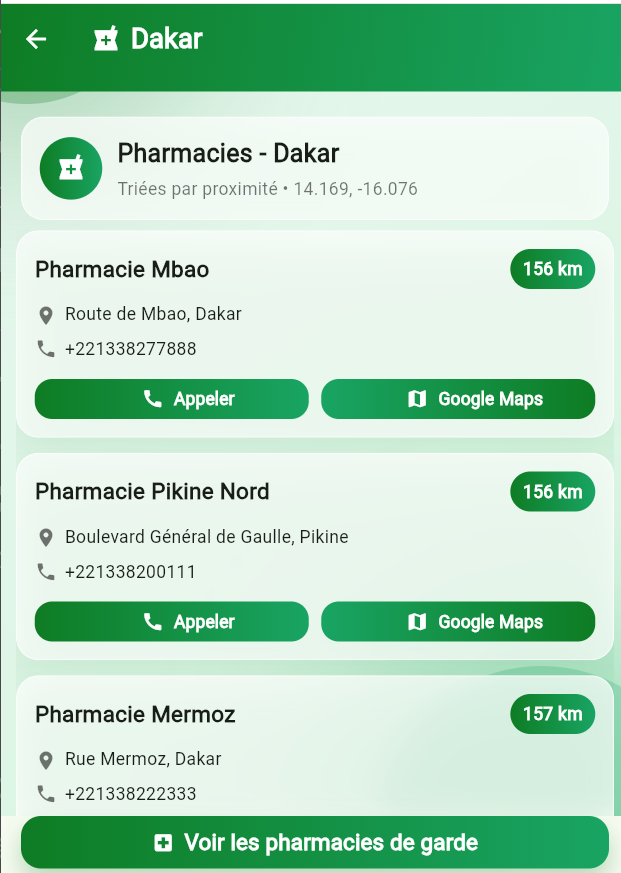

# 🏥 Pharmacie H24


**Application Flutter/Dart** qui permet aux utilisateurs de :  
- Trouver les **pharmacies de garde en temps réel**  
- Localiser la **pharmacie la plus proche** selon leur position  
- Obtenir la **distance en km et l’itinéraire via Google Maps**

---

## 📸 Aperçu
<p align="center">
  
</p>

<p align="center">
  
</p>


---

## ⚡ Fonctionnalités

- Recherche en temps réel des pharmacies ouvertes  
- Affichage sur carte avec itinéraire et distance  
- Notifications (optionnel)  
- Multi-plateforme : Android, iOS, Web  

---

## 🛠️ Technologies et outils

- **Langages :** Dart, Flutter  
- **IDE :** VS Code, Android Studio  
- **APIs :** Google Maps API  
- **Sécurité :** Bonnes pratiques pour protéger les données et l’application  

---

## 🚀 Installation

1. Cloner le dépôt :  

```bash
git clone https://github.com/DebugNinja10/Pharmacie-H24.git

Aller dans le dossier du projet :

cd Pharmacie-H24


Installer les dépendances :

flutter pub get


Lancer l’application :

flutter run

💡 Ressources

Documentation Flutter

Codelab Flutter

🌟 Auteur

Abdou Aziz Seck — Développeur Fullstack & Flutter / Cybersécurité

GitHub : DebugNinja10

Email : seckabdouaziz749@gmail.com